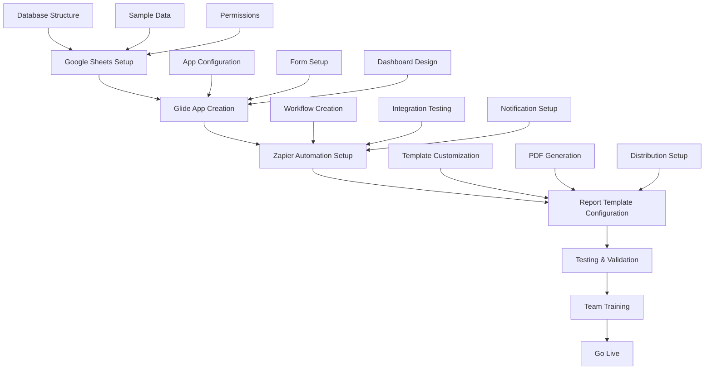

# Al Ghadeer Events - File Structure 📁

## Project Overview
This repository contains all the necessary files and templates to set up the Al Ghadeer Events Management System.

```
alghadeerEvents/
├── README.md                           # Complete setup guide and documentation
├── setup-checklist.md                 # Step-by-step implementation checklist
├── file-structure.md                  # This file - project structure overview
│
├── 📊 DATABASE FILES
├── google-sheets-template.csv         # Complete database structure with sample data
│   ├── Events Sheet                   # Main event management data
│   ├── Payments Sheet                 # Payment tracking and receipts
│   ├── EmployeesPayments Sheet        # Staff wages and payment records
│   ├── PriceList Sheet               # Default pricing for services
│   ├── Reminders Sheet               # Task and reminder management
│   ├── Contacts Sheet                # Event contact information
│   ├── Tasks Sheet                   # Operational task tracking
│   └── Languages Sheet               # Multi-language translations
│
├── 📱 APP CONFIGURATION
├── glide-app-config.json             # Complete Glide app structure and components
│   ├── Navigation Setup              # Tab configuration and icons
│   ├── Screen Definitions            # All app screens and layouts
│   ├── Form Configurations           # Event, payment, employee, reminder forms
│   ├── Dashboard Components          # Charts, metrics, and analytics
│   ├── Automation Triggers           # App-level automations
│   └── Language Settings             # Multi-language support config
│
├── 🤖 AUTOMATION FILES
├── zapier-automations.json           # All Zapier automation templates
│   ├── Monthly Report Automation     # Auto-generate monthly PDF reports
│   ├── Payment Reminder System       # Overdue payment notifications
│   ├── Task Reminder Notifications   # Due task and reminder alerts
│   ├── New Event Notifications       # Team alerts for new events
│   ├── Manual Report Trigger         # On-demand report generation
│   └── Webhook Endpoints             # Integration URLs and setup
│
├── 📄 REPORT TEMPLATES
├── monthly-report-template.html      # Hebrew PDF report template
│   ├── Header Section               # Company branding and title
│   ├── Financial Summary Cards      # Revenue, expenses, profit overview
│   ├── Profitability Meter         # Visual profitability indicator
│   ├── Events Summary Table         # All events with payment status
│   ├── Payment Details Table        # Payment history and methods
│   ├── Employee Payments Table      # Staff wage and payment records
│   ├── Outstanding Balances         # Unpaid amounts and alerts
│   └── Footer & Contact Info        # Company details and generation date
│
└── 📋 DOCUMENTATION
    ├── User Guide Sections          # Detailed feature explanations
    ├── Setup Instructions           # Platform-specific setup guides
    ├── Troubleshooting Guide        # Common issues and solutions
    ├── Security & Privacy Info      # Data protection and access control
    ├── Feature Roadmap             # Current and upcoming features
    └── Support & Contact Info       # Technical and business support
```

## Key Components Breakdown

### 🗃️ Database Structure (Google Sheets)
**File**: `google-sheets-template.csv`

- **Events**: Core event management with pricing, location, and service tracking
- **Payments**: Complete payment history with receipt upload support
- **EmployeesPayments**: Staff management with hourly wages and payment tracking
- **PriceList**: Default pricing catalog for quick event setup
- **Reminders**: Task and reminder system with recurring options
- **Contacts**: Client contact information linked to events
- **Tasks**: Operational task management for team coordination
- **Languages**: Translation tables for English, Hebrew, and Arabic

### 📲 Mobile App (Glide)
**File**: `glide-app-config.json`

#### Main Navigation Tabs:
1. **📊 Dashboard** - Analytics, profitability metrics, quick overviews
2. **📅 Events** - Full event management with dynamic pricing
3. **💳 Payments** - Payment tracking with receipt upload
4. **👥 Employees** - Staff management and wage calculation
5. **🔔 Reminders** - Task and reminder management system

#### Key Features:
- **Dynamic Forms**: Event creation with conditional fields
- **Real-time Calculations**: Automatic pricing and profitability
- **Receipt Upload**: Image/PDF receipt storage
- **Multi-language UI**: Seamless language switching
- **Mobile Optimization**: Touch-friendly interface

### 🔄 Automations (Zapier)
**File**: `zapier-automations.json`

#### Automated Workflows:
1. **Monthly Reports**: Auto-generate and distribute PDF reports
2. **Payment Reminders**: WhatsApp alerts for overdue payments
3. **Task Notifications**: Push notifications for due reminders
4. **Event Alerts**: Team notifications for new events
5. **Manual Reports**: On-demand report generation

#### Integration Points:
- **Google Sheets**: Data source and trigger
- **Email**: Report distribution and notifications
- **WhatsApp**: Customer and team communication
- **PDF Generator**: Professional report creation

### 📊 Reporting System
**File**: `monthly-report-template.html`

#### Report Sections:
- **Executive Summary**: Financial overview with visual indicators
- **Event Details**: Complete event listing with payment status
- **Financial Analysis**: Revenue, expenses, and profitability metrics
- **Staff Management**: Employee payment summaries
- **Outstanding Items**: Unpaid balances and follow-up actions

#### Design Features:
- **Hebrew RTL Layout**: Right-to-left text and layout
- **Professional Styling**: Corporate branding and formatting
- **Visual Analytics**: Charts and profitability meters
- **Print Optimization**: PDF-ready formatting

## Implementation Flow



## File Dependencies

### Core Dependencies:
- **Google Sheets** ← Database foundation
- **Glide Apps** ← Mobile interface
- **Zapier** ← Automation engine
- **Email Service** ← Notification delivery
- **WhatsApp Business** ← Communication platform

### Optional Enhancements:
- **Custom Domain** ← Professional app URL
- **Advanced Analytics** ← Enhanced reporting
- **API Integrations** ← Third-party connections
- **Backup Solutions** ← Data protection

## Maintenance Schedule

### Daily:
- Monitor automation logs
- Check new event notifications
- Review payment reminders

### Weekly:
- Validate data consistency
- Review outstanding balances
- Update price list if needed

### Monthly:
- Generate and review monthly reports
- Backup database
- Update language translations
- Review and optimize automations

### Quarterly:
- Performance analysis
- Feature usage review
- Security audit
- Team training updates

---

## Quick Start Commands

### 1. Database Setup
```bash
# Copy template to Google Sheets
# Import google-sheets-template.csv
# Configure sheet permissions
```

### 2. App Creation
```bash
# Import glide-app-config.json to Glide
# Connect to Google Sheets database
# Customize branding and colors
```

### 3. Automation Setup
```bash
# Import zapier-automations.json to Zapier
# Connect integrations (Sheets, Email, WhatsApp)
# Test all workflows
```

### 4. Report Configuration
```bash
# Upload monthly-report-template.html
# Configure PDF generation service
# Test report generation and delivery
```

---

**Total Setup Time**: 4-5 hours
**Maintenance Time**: 30 minutes/week
**Team Training**: 1 hour initially

*For detailed setup instructions, see `setup-checklist.md`*
*For complete documentation, see `README.md`*